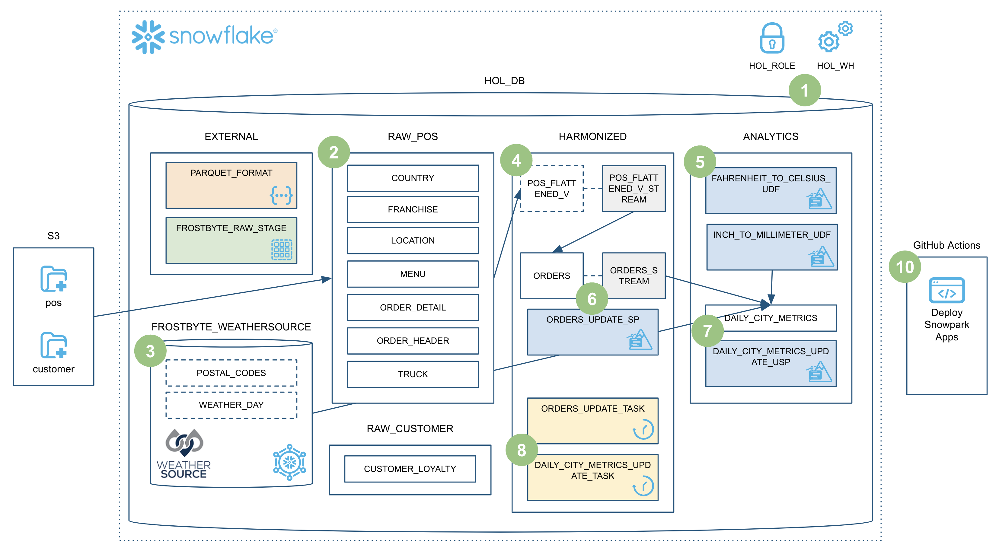

# Data Engineering Pipelines with Snowpark Python
This repository contains the code for the *Data Engineering Pipelines with Snowpark Python* Snowflake Quickstart.

### ➡️ For overview, prerequisites, and to learn more, complete this end-to-end tutorial [Data Engineering Pipelines with Snowpark Python](https://quickstarts.snowflake.com/guide/data_engineering_pipelines_with_snowpark_python/index.html?index=..%2F..index#0) on quickstarts.snowflake.com.

___
Here is an overview of what we'll build in this lab:

