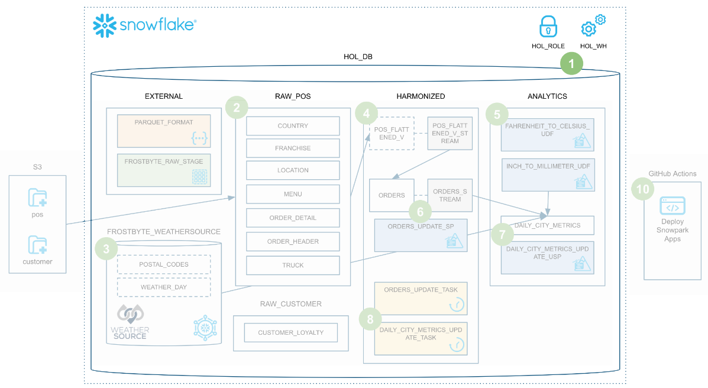
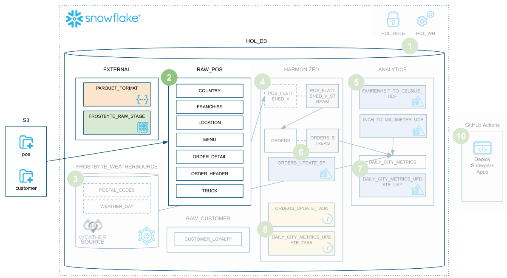
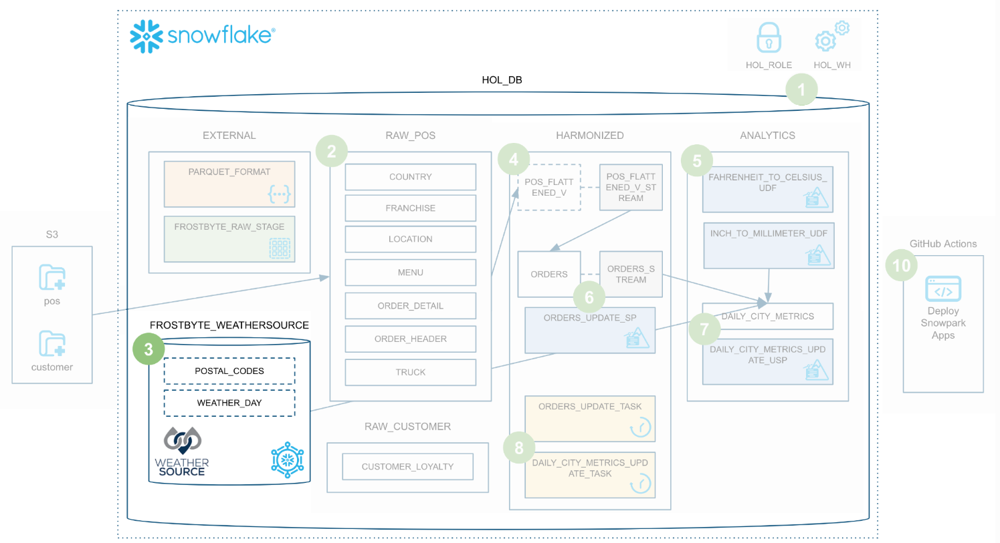
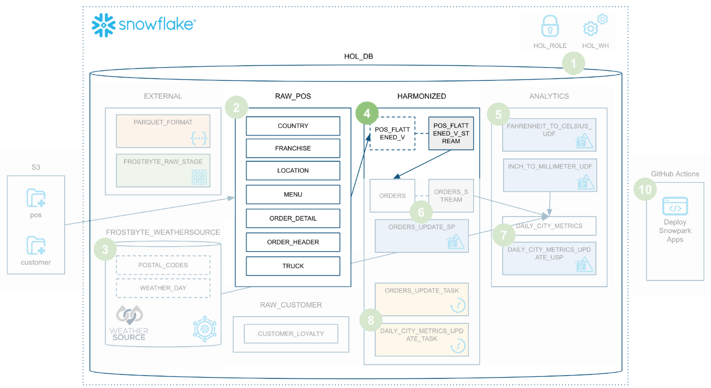
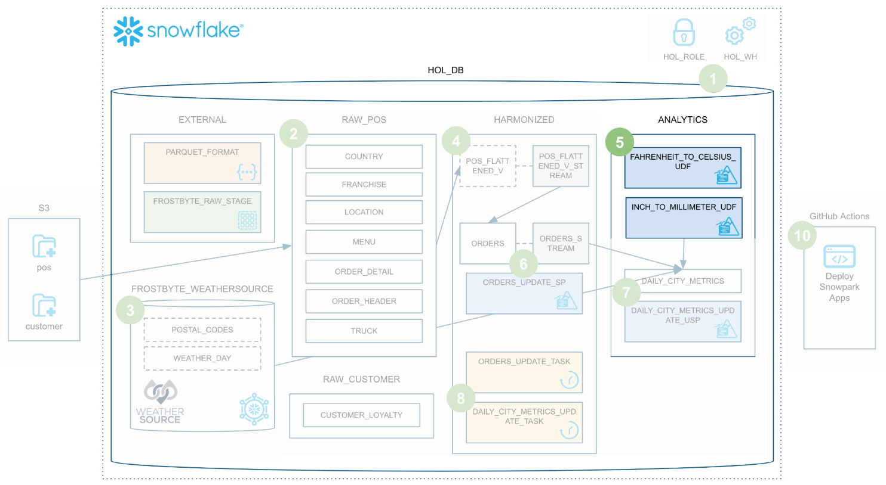
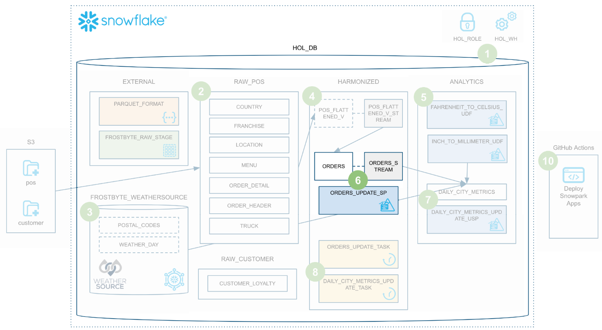
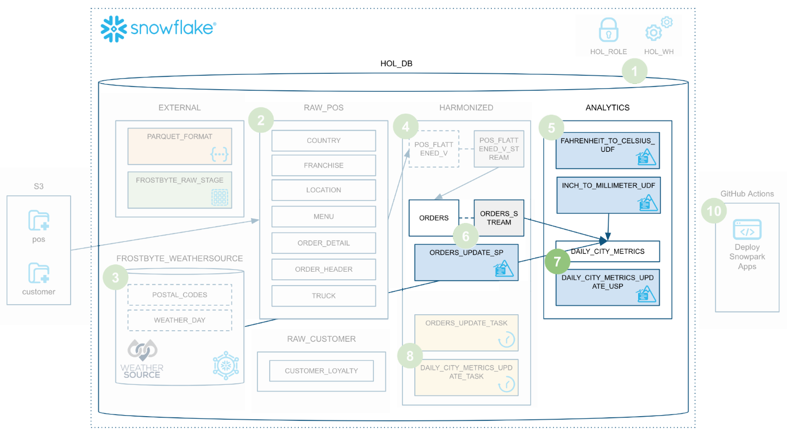
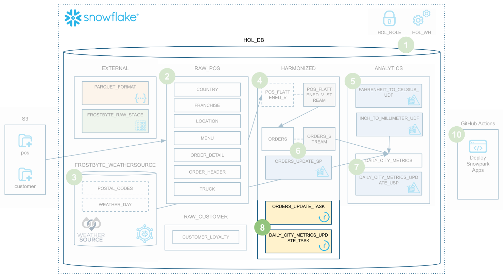
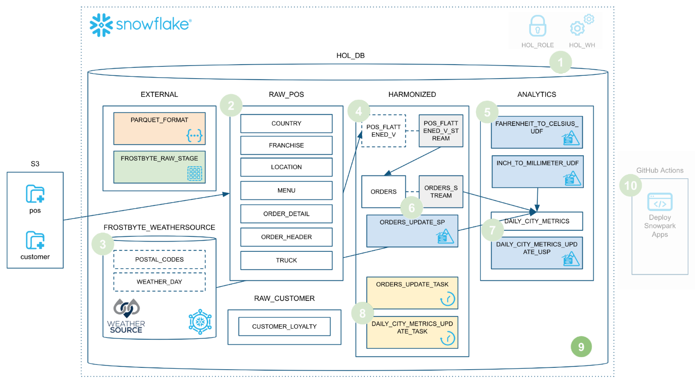
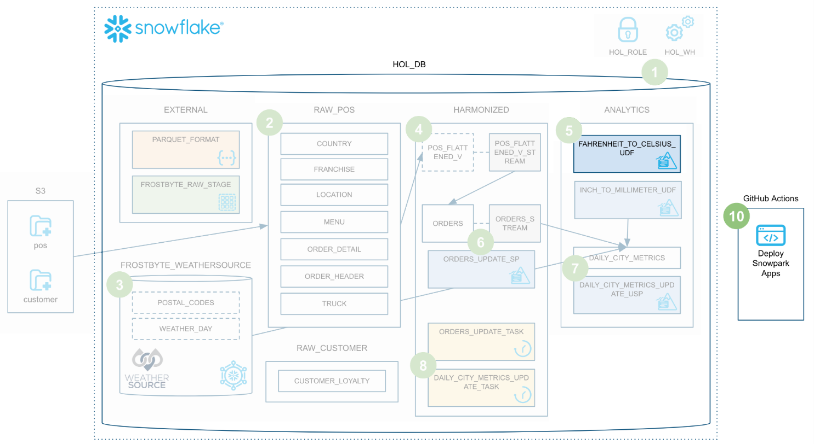

# Data Engineering Pipelines with Snowpark Python Lab Guide

This README contains the overview and lab instructions for *Data Engineering Pipelines with Snowpark Python* code contained in this repository.

### ➡️ for prerequisites, see this guide for detailed steps [Data Engineering Pipelines with Snowpark Python Prerequisites](https://offers.phdata.io/hubfs/Snowpark%20Hands-On%20Lab%20Flyer_D4.pdf).

Here is an overview of what we'll build in this lab:


## Step 1 - Setup Anaconda Virtual Environment and Snowflake

### Create Anaconda Environment
This lab will take place inside an Anaconda virtual environment running in the Codespace. You will create and activate an Anaconda environment for this lab using the supplied conda_env.yml file. Run these commands from a terminal in the root of your local forked repository.
```
conda env create -f conda_env.yml
conda init bash
```
You will need to close and reopen the terminal, then execute:
```
conda activate pysnowpark
```

### Snowflake Setup
This step will create the necessary role, warehouse, database, and schema for the hands-on lab. We will create 4 schemas for our data maturity model; external, RAW_POS, RAW_CUSTOMER, HARMONIZED, and ANALYTICS.



Before executing the SQL script, ensure you are logged into Snowflake via the extension in Codespaces. Select the Snowflake icon in the left navigation bar and verify you are connected, otherwise log in with your credentials. Once logged in, open the `steps/01_setup_snowflake.sql` script by going to the file Explorer in the left navigation bar.

To run all the queries in this script, use the "Execute All Statements" button in the upper right corner of the editor window.

## Step 2 - Load Raw Data

During this step we will be loading the raw Tasty Bytes POS and Customer loyalty data from raw Parquet files in `s3://sfquickstarts/data-engineering-with-snowpark-python/` to our `RAW_POS` and `RAW_CUSTOMER` schemas in Snowflake. We are going to be orchestrating this process from Codespaces in Python using the Snowpark Python API. To put this in context, we are on step **#2** in our data flow overview:



To load the raw data, we will be executing the `steps/02_load_raw.py script`. To execute this script ensure that the `pysnowpark` Conda environment is active, then run the following commands (which assume that your terminal has the root of your repository open):

```
cd steps
python 02_load_raw.py
```

## Step 3 - Load Weather Data
During this step we will be "loading" the raw weather data to Snowflake. But "loading" is really the wrong word here. Because we're using Snowflake's unique data-sharing capability we don't actually need to copy the data to our Snowflake account with a custom ETL process. Instead, we can directly access the weather data shared by Weather Source in the Snowflake Data Marketplace. To put this in context, we are on step **#3** in our data flow overview:



Weather Source is a leading provider of global weather and climate data and their OnPoint Product Suite provides businesses with the necessary weather and climate data to quickly generate meaningful and actionable insights for a wide range of use cases across industries. Let's connect to the `Weather Source LLC: frostbyte` feed from Weather Source in the Snowflake Data Marketplace by following these steps:

* Login to Snowsight
* Click on the Marketplace link in the left navigation bar
* Enter "Weather Source LLC: frostbyte" in the search box and click return
* Click on the "Weather Source LLC: frostbyte" listing tile
* Click the blue "Get" button
 * Expand the "Options" dialog
 * Change the "Database name" to read "FROSTBYTE_WEATHERSOURCE" (all capital letters)
 * Select the "HOL_ROLE" role to have access to the new database
* Click on the blue "Get" button

### Run The Script ###
Open the `steps/03_load_weather.sql` script in Codespaces from the file Explorer in the left navigation bar, and run the script, which contains the following SQL query.

```
SELECT * FROM FROSTBYTE_WEATHERSOURCE.ONPOINT_ID.POSTAL_CODES LIMIT 100;
```

## Step 4 - Create POS View
During this step we will be creating a view to simplify the raw POS schema by joining together 6 different tables and picking only the columns we need. What's really cool is that we're going to define that view with the Snowpark DataFrame API, then we're going to create a Snowflake stream on that view so that we can incrementally process changes to any of the POS tables. To put this in context, we are on step **#4** in our data flow overview:



### Run the Script ###
To create the view and stream, execute the `steps/04_create_pos_view.py script`. Like we did in step 2, let's execute it from the terminal. The following commands assume that your terminal has the root of your repository open, if already in the steps directory, just execute the python command.
```
cd steps
python 04_create_pos_view.py
```

## Step 5 - Fahrenheit to Celsius UDF
During this step we will be creating and deploying our first Snowpark Python object to Snowflake, a user-defined function (or UDF). The UDF will be very basic to begin with, but in a future step, we'll update it to include a third-party Python package. Additionally, you will be introduced to the new SnowCLI, a new developer command line tool. SnowCLI makes building and deploying Snowpark Python objects to Snowflake a consistent experience for the developer. To put this in context, we are on step **#5** in our data flow overview:



### Running the UDF Locally ####
To test the UDF locally, you will execute the `steps/05_fahrenheit_to_celsius_udf/app.py` script. Like we did in the previous steps, we'll execute it from the terminal. The following commands assume you are already in the `steps` directory of the repository.
```
cd 05_fahrenheit_to_celsius_udf
python app.py 35
```


While developing a UDF, you can simply run it locally. If your UDF doesn't need to query data from Snowflake, this process will be entirely local.

### Deploying the UDF to Snowflake ###

To deploy your UDF to Snowflake we will use the SnowCLI tool. The SnowCLI tool will do all the heavy lifting of packaging up your application, copying it to a Snowflake stage, and creating the object in Snowflake.

```
snow function create
```
### Running the UDF in Snowflake ###
In order to run the UDF in Snowflake we have a few options. Any UDF in Snowflake can be invoked through SQL as follows:

```
SELECT ANALYTICS.FAHRENHEIT_TO_CELSIUS_UDF(35);
```

With the SnowCLI utility you can also invoke the UDF from the terminal in Codespaces as follows:

```
snow function execute -f "fahrenheit_to_celsius_udf(35)"
```

## Step 6 - Orders Update Sproc

During this step we will be creating and deploying our first Snowpark Python stored procedure (or sproc) to Snowflake. This sproc will merge changes from the `HARMONIZED.POS_FLATTENED_V_STREAM` stream into our target `HARMONIZED.ORDERS` table. To put this in context, we are on step **#6** in our data flow overview:



### Running the Sproc Locally  ### 
To test the procedure locally, you will execute the `steps/06_orders_update_sp/app.py` script. These commands assume you are still in the directory from previous step so we will need to go back one directory.

```
cd ..
cd 06_orders_update_sp
python app.py
```

While we’re developing the sproc, the Python code will run locally on your laptop, but the Snowpark DataFrame code will issue SQL queries to your Snowflake account.

### Deploying the Sproc to Snowflake ###

To deploy your sproc to Snowflake we will again use the SnowCLI tool.
```
snow procedure create
```

### Running the Sproc in Snowflake ###

In order to run the sproc in Snowflake we have a few options. Any sproc in Snowflake can be invoked through SQL as follows:

```
CALL ORDERS_UPDATE_SP();
```

With the SnowCLI utility you can also invoke the UDF from the terminal in Codespaces as follows:

```
snow procedure execute -p "orders_update_sp()"
```

## Step 7 - Daily City Metrics Update Sproc

During this step we will be creating and deploying our second Snowpark Python sproc to Snowflake. This sproc will join the `HARMONIZED.ORDERS` data with the Weather Source data to create a final, aggregated table for analysis named `ANALYTICS.DAILY_CITY_METRICS`. We will process the data incrementally from the `HARMONIZED.ORDERS` table using another Snowflake Stream. And we will again use the Snowpark DataFrame `merge()` method to merge/upsert the data. To put this in context, we are on step **#7** in our data flow overview:



### Running the Sproc Locally ###

To test the procedure locally, you will execute the steps/07_daily_city_metrics_update_sp/app.py script.

```
cd ..
cd 07_daily_city_metrics_update_sp
python app.py
```

### Deploying the Sproc to Snowflake ###

To deploy your sproc to Snowflake we will again use the SnowCLI tool. 

```
snow procedure create
```

### Running the Sproc in Snowflake ###

In order to run the sproc in Snowflake you have a few options. Any sproc in Snowflake can be invoked through SQL as follows:

```
CALL DAILY_CITY_METRICS_UPDATE_SP();
```


With the SnowCLI utility you can also invoke the UDF from the terminal in Codespaces as follows:

```
snow procedure execute -p "daily_city_metrics_update_sp()"
```

## Step 8 - Orchestrate Jobs

During this step we will be orchestrating our new Snowpark pipelines with Snowflake's native orchestration feature named Tasks. We will create two tasks, one for each stored procedure, and chain them together. We will then run the tasks. To put this in context, we are on step **#8** in our data flow overview:



### Run the Script ###

Since this is a SQL script we will be using the native Codespaces extension to execute it. Open the `steps/08_orchestrate_jobs.sql` script in Codespaces and run the whole thing using the "Execute All Statements" button in the upper right corner of the editor window.

### Running the Tasks ###

In this step we did not create a schedule for our task DAG, so it will not run on its own at this point. In this script you will notice that we manually execute the DAG, like this:

```
EXECUTE TASK ORDERS_UPDATE_TASK;
```

To see what happened when you ran this task just now, highlight and run (using CMD/CTRL+Enter) this commented query in the script:

```
SELECT *
FROM TABLE(INFORMATION_SCHEMA.TASK_HISTORY(
    SCHEDULED_TIME_RANGE_START=>DATEADD('DAY',-1,CURRENT_TIMESTAMP()),
    RESULT_LIMIT => 100))
ORDER BY SCHEDULED_TIME DESC
;
```

## Step 9 - Process Incrementally

During this step, we will be adding new data to our POS order tables, then running our entire end-to-end pipeline to process the new data. This entire pipeline will be processing data incrementally thanks to Snowflake's advanced stream/CDC capabilities. To put this in context, we are on step **#9** in our data flow overview:



Since this is a SQL script we will be using our native Codespaces extension to execute it. Open the `steps/09_process_incrementally.sql` script in Codespaces and run the whole thing using the "Execute All Statements" button in the upper right corner of the editor window.

### Viewing the Task History ###

Like in the previous step, to see what happened when you ran this task DAG, highlight and run (using CMD/CTRL+Enter) this commented query in the script:

```
SELECT *
FROM TABLE(INFORMATION_SCHEMA.TASK_HISTORY(
    SCHEDULED_TIME_RANGE_START=>DATEADD('DAY',-1,CURRENT_TIMESTAMP()),
    RESULT_LIMIT => 100))
ORDER BY SCHEDULED_TIME DESC
;
```

## Step 10 - Deploy Via CI/CD

During this step we will be making a change to our `FAHRENHEIT_TO_CELSIUS_UDF()` UDF and then deploying it via a CI/CD pipeline. We will be updating the `FAHRENHEIT_TO_CELSIUS_UDF()` UDF to use a third-party Python package, pushing it to your forked GitHub repo, and finally deploying it using the SnowCLI in a GitHub Actions workflow! To put this in context, we are on step **#10** in our data flow overview:



### Update the Fahrenheit to Celsius UDF ###

We will be replacing our hard-coded temperature conversion with a package from `scipy`. First we will make a few changes to the `steps/05_fahrenheit_to_celsius_udf/app.py` script. In this file we will be adding an import command and replacing the body of the `main()` function. Open the `steps/05_fahrenheit_to_celsius_udf/app.py` script in Codespaces and replace this section:

```
import sys

def main(temp_f: float) -> float:
    return (float(temp_f) - 32) * (5/9)
```


With this:

```
import sys
from scipy.constants import convert_temperature

def main(temp_f: float) -> float:
    return convert_temperature(float(temp_f), 'F', 'C')
```

##### Don’t forget to save changes to the file! #####

The second change we need to make is to add scipy to our `requirements.txt` file. Open the `steps/05_fahrenheit_to_celsius_udf/requirements.txt` file in Codespaces, add a newline with `scipy` on it, and save it.

### Test your Changes Locally ###

To test the UDF locally, you will execute the `steps/05_fahrenheit_to_celsius_udf/app.py` script.

```
cd ..
cd 05_fahrenheit_to_celsius_udf
pip install -r requirements.txt
python app.py 35
```

Notice that this time we're also running pip install to make sure that our dependent packages are installed. Once your function runs successfully we'll be ready to deploy it via CI/CD.

### Configuring Your Forked GitHub Project ###

In order for your GitHub Actions workflow to be able to connect to your Snowflake account you will need to store your Snowflake credentials in GitHub. This should already have been done as part of the prerequisites. If you have not yet set up the secrets, follow the [steps in the prerequistes guide](https://docs.google.com/document/d/1ezyB9_NEPOTtSBdLUQrLU1dyP4ax5HM_2Devut8kgYw/edit#bookmark=id.r4p2jy9mzt29) to complete this step.


### Push Changes to Forked Repository ###

Now that we have changes ready and tested, and our Snowflake credentials stored in GitHub, let's commit them to our local repository and then push them to your forked repository. This can certainly be done from the command line, but in this step we'll do so through Codespaces to make it easy.

Start by opening the "Source Control" extension in the left hand nav bar, you should see two files with changes. Click the `+` (plus) sign at the right of each file name to stage the changes. Then enter a message in the "Message" box and click the blue `Commit` button to commit the changes locally. 

At this point those changes are only committed locally and have not yet been pushed to your forked repository in GitHub. To do that, simply click the blue `Sync Changes` button to push these commits to GitHub. 

### Viewing GitHub Actions Workflow ###

This repository is already set up with a very simple GitHub Actions CI/CD pipeline. You can review the code for the workflow by opening the `.github/workflows/build_and_deploy.yaml` file in Codespaces.

## Step 11 - Deploy Streamlit Application

Now that we've created a data pipline to combine POS data with Weather data, let's create a simple Streamlit application to visualize the data and see if we can identify any correlation that warrants further discovery by the Analytics, or Data Science team.

To deploy the application, we will use the streamlit run command:

```
cd ..
streamlit run 11_create_streamlit_app.py --server.enableCORS false --server.enableXsrfProtection false
```

Note: All of the packages for this application have already been installed in the Conda environment via the conda_env.yml. Additionally, the `--server` arguments in the streamlit run command are specific to launching the streamlit app and using github's compute. If running streamlit locally, these are not necessary.

## Step 12 - Teardown

Now that you’re finished with the lab, you can simply run the `steps/12_teardown.sql` script to tear down the Snowflake environment. Open the `steps/12_teardown.sql` script in Codespaces and run the whole thing using the "Execute All Statements" button in the upper right corner of the editor window.

## Lab Conclusion

In this Lab we have built a robust data engineering pipeline using Snowpark Python stored procedures. This pipeline processes data incrementally, is orchestrated with Snowflake tasks, and is deployed via a CI/CD pipeline. You also learned how to use Snowflake's new developer CLI tool and Visual Studio Code/Codespaces extension! This lab has only just touched on what's possible with Snowpark. Hopefully, you now have the building blocks and examples that you need to get started building your own data engineering pipeline with Snowpark Python. So, what will you build next?

If you want to go through this lab again in a self-paced format, visit [Data Engineering Pipelines with Snowpark Python](https://rise.articulate.com/share/RVLdNfMfvFnSC-zWXQBK795EaTueQ8u7). This course is hosted by phData using the content from Snowflake's [Data Engineering Pipelines with Snowpark Python quickstart](https://quickstarts.snowflake.com/guide/data_engineering_pipelines_with_snowpark_python/#0), with customized content from the BUILD.Local Snowpark series you attended.
