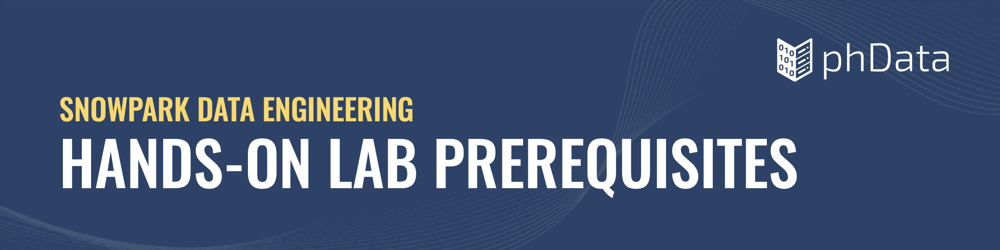
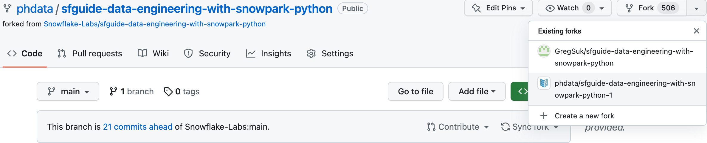
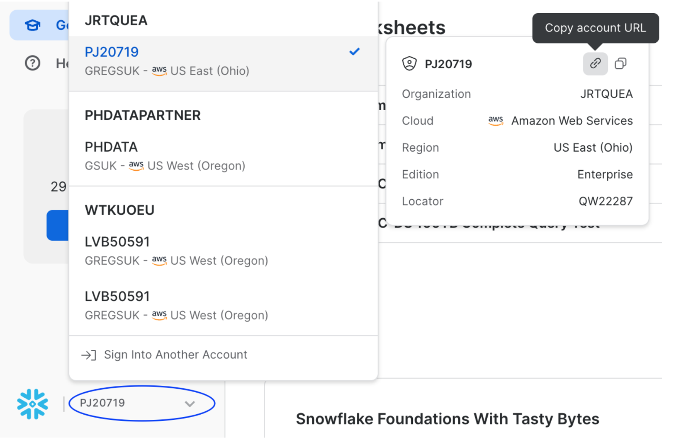
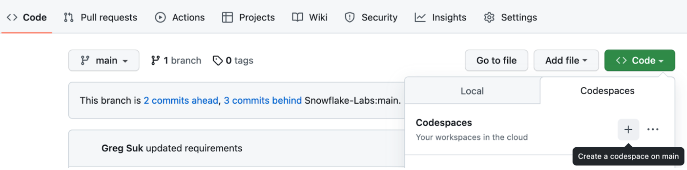
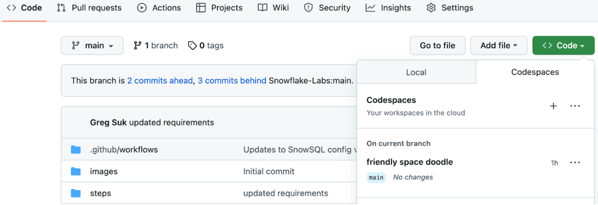
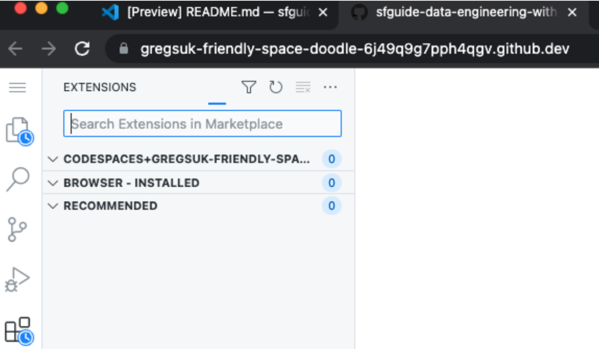
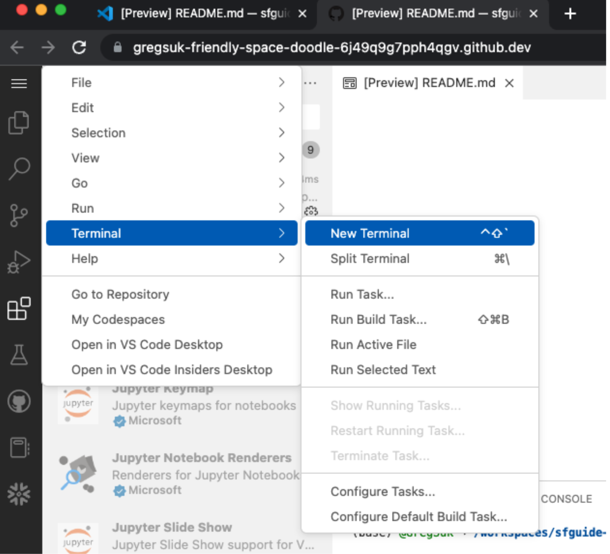

## SNOWFLAKE PREREQUISITES
**You'll need a Snowflake account with a user created with ACCOUNTADMIN permissions.**
This user will be used to get things set up in Snowflake.
- It is strongly recommended to sign up for a free 30 day trial Snowflake account for this lab. Once you’ve
registered, you’ll get an email that will bring you to Snowflake so that you can sign in.
- **Make sure to Activate your account** and pick a username and password that you will remember. This will
be important for logging in later on.
- **Anaconda Terms & Conditions accepted. See Getting Started section in [Third-Party Packages](https://docs.snowflake.com/en/developer-guide/udf/python/udf-python-packages#getting-started).**

## GITHUB PREREQUISITES

### Fork and Clone Repository for Quickstart
You’ll need to create a fork of the repository for this lab in your GitHub account, which if you are reading this file you've likely already done that. However, you can check for updates to the repository and lab by visiting phData’s
[Data Engineering Pipelines with Snowpark Python](https://github.com/phdata/sfguide-data-engineering-with-snowpark-python/) associated GitHub Repository and click on the Fork
button near the top right. Complete any required fields and click Create Fork.



By default GitHub Actions disables any workflows (or CI/CD pipelines) defined in the forked repository.
This repository contains a workflow to deploy your Snowpark Python UDF and stored procedures, which
we’ll use later on. So for now enable this workflow by opening your forked repository in GitHub, clicking on
the Actions tab near the top middle of the page, and then clicking on the I understand my workflows, go
ahead and enable them green button.

### GitHub Actions

In order for your GitHub Actions workflow to be able to connect to your Snowflake account you will need to store your Snowflake credentials in GitHub. Action Secrets in GitHub are used to securely store values/variables which will be used in your CI/CD pipelines. In this step, we will create secrets for each of the parameters.

- From the repository, click on the Settings tab near the top of the page. From the Settings page, click on the "Secrets and variables" then "Actions" tab in the left-hand navigation. The Actions secrets should be selected. For each secret listed below click on "New repository secret" near the top right and enter the name given below along with the appropriate value (adjusting as appropriate).

    Secret Name | Secret Value
    ------------|--------------
    SNOWSQL_ACCOUNT | \<myaccount\>
    SNOWSQL_USER | \<myusername\>
    SNOWSQL_PWD | \<mypassword\>
    SNOWSQL_ROLE | HOL_ROLE
    SNOWSQL_WAREHOUSE | HOL_WH
    SNOWSQL_DATABASE | HOL_DB

- Notes:
    - To get the SNOWSQL_ACCOUNT, in the Snowflake console click on your account name in the lower left, hover over your account, then select Copy account URL.

    

    - The account is **identifier.region.cloudprovider** prior to **.snowflakecomputing.com** 

    

### Create a GitHub Codespace

Note: This development can be done on your desktop with VS Code, however Codespaces greatly simplifies the prerequisites and complexities of local development.



- If you’ve already created a Codespace, it can be launched and stopped from this window as well.

    

- Once the Codespace is launched, you will need to install python and Snowflake extensions

    

- Python extension installed. Search for and install the “Python” extension (from Microsoft) in the
Extensions pane in the Codespace.
- Snowflake extension installed. Search for and install the “Snowflake” extension (from Snowflake) in the
Extensions pane in the Codespace.
   - Select the Snowflake icon in the left pane of the Codespace to sign into snowflake extension using
your snowflake URL then enter your username and password.
        -  Note: to get the snowflake URL, just as you did for the GitHub secret step; in the Snowflake console click
on your account name in the lower left, hover over your account, then select Copy account URL.
- Once you are signed into the Snowflake extension, open a new terminal

    

### Create Snowflake Credentials File
In the Codespace terminal execute the following commands:
```
mkdir ~/.snowsql
vi ~/.snowsql/config
```

Add your account details to the create credentials file for snowsql, which are the exact same values used for the Github secrets. Copy the credentials from this file into vi. To save and exit, execute shift + ZZ in the terminal:
Note: we aren’t actually installing or using snowsql, just creating the credentials in the location that the snowpark_utils python file expects them to be, since we are just deploying code to Snowflake and not staging local data.
If you have successfully completed all the steps, congratulations you are ready for the Hands on Lab! If you completed these prerequisites prior to attending the Hands on Lab, you can stop the Codespace in Github where you launched it from, or it will automatically stop after 30 mintues

#### Create Snowsql Credentials File
```
[connections.dev]
accountname = myaccount
username = myusername
password = "mypassword"
rolename = HOL_ROLE
warehousename = HOL_WH
dbname = HOL_DB
```

Note: Password will need to be escaped with double quotes if it contains special characters for example "sdfT*#092$"
